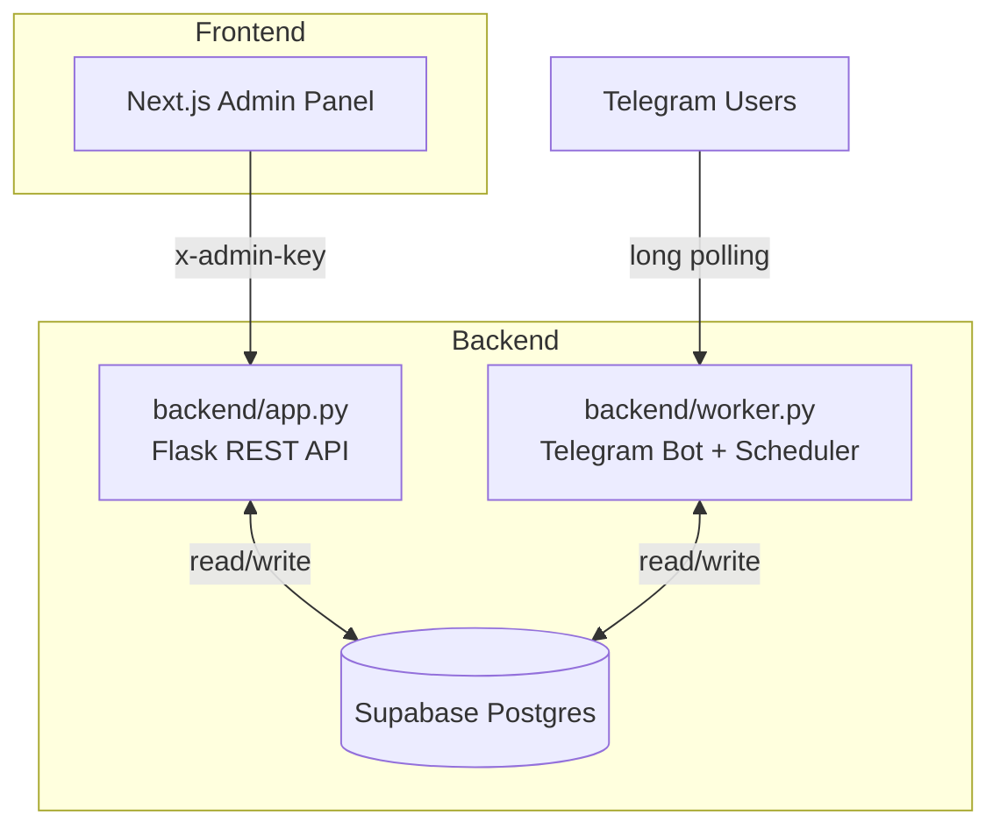

# QuotexAI Pro — Full Stack Overview (2025)

This repo is a monorepo with a Python backend (Flask API + Telegram worker) and a Next.js admin frontend. It is wired for Supabase Postgres and cloud deploy on Render (backend) + Vercel (frontend).

---

## Architecture (Current)



### Backend
- `backend/app.py`
  - Endpoints: `/health`, `/health/db`, `/api/stats`, `/api/users`, `/api/grant`, `/api/revoke`, `/api/message`, `/api/broadcast`, `/api/cron`.
  - CORS controlled by `FRONTEND_ORIGIN`.
- `backend/worker.py`
  - Long polling bot with commands: `/start`, `/help`, `/id`, `/status`, `/premium`, `/verify_upi <txn>`, `/verify_usdt <txhash>`.
  - On start: clears Telegram webhook to avoid conflicts.
  - Scheduler loop (hourly by default) sends expiry reminders and marks expired.
  - Optional auto‑verification for USDT via TronGrid/Etherscan/BscScan/Polygon if API keys are set.
- `backend/database.py`
  - Connects to Supabase Postgres via `DATABASE_URL` (Service Role, port 5432, `sslmode=require`).

### Frontend (Next.js)
- `frontend/` Next.js App Router + Tailwind.
- Server routes in `frontend/app/api/*` proxy to the backend using server envs (`BACKEND_URL`, `ADMIN_API_KEY`).
- Pages: `/` dashboard, `/users`, `/messages`, `/broadcast`.

---

## Environment Variables Matrix

### Render Web Service (runs `backend/app.py`)
- `DATABASE_URL` = `postgresql://postgres:<SERVICE_ROLE_KEY>@db.<project>.supabase.co:5432/postgres?sslmode=require`
- `ADMIN_API_KEY` = strong secret used by admin endpoints and cron
- `FRONTEND_ORIGIN` = `https://<your-vercel-domain>`
- `BOT_TOKEN` = Telegram token (required for `/api/message` and `/api/broadcast`)

### Render Background Worker (runs `backend/worker.py`)
- Required: `DATABASE_URL`, `BOT_TOKEN`
- Payments (shown in `/premium`): `UPI_ID`, `USDT_TRC20_ADDRESS`, `EVM_ADDRESS`
- Auto‑verification (optional): `TRONGRID_API_KEY`, `ETHERSCAN_API_KEY`, `BSCSCAN_API_KEY`, `POLYGONSCAN_API_KEY`
- Tuning (optional): `POLL_INTERVAL_SECONDS` (default 30), `SCHEDULER_INTERVAL_SECONDS` (default 3600)

### Vercel (Next.js frontend)
- `BACKEND_URL` = Render Web base URL
- `ADMIN_API_KEY` = same as Render Web (server‑side only)

### Local `.env` (repo root)
```env
DATABASE_URL=postgresql://postgres:<encoded-service-role-key>@db.<project>.supabase.co:5432/postgres?sslmode=require
BOT_TOKEN=123:abc
ADMIN_API_KEY=dev-key
FRONTEND_ORIGIN=http://localhost:3000
UPI_ID=yourname@oksbi
USDT_TRC20_ADDRESS=Txxxxxxxxxxxxxxxxxxxxxxxxxx
EVM_ADDRESS=0xYourEvmAddress
```

---

## Local Development

```powershell
# In repo root
py -m venv .venv
./.venv/Scripts/Activate.ps1
pip install -r requirements.txt

# Web API
$env:DATABASE_URL="postgresql://...:5432/postgres?sslmode=require"
$env:ADMIN_API_KEY="dev-key"
$env:FRONTEND_ORIGIN="http://localhost:3000"
$env:BOT_TOKEN="123:abc"
py backend/app.py

# Worker (in a second terminal)
$env:DATABASE_URL="postgresql://...:5432/postgres?sslmode=require"
$env:BOT_TOKEN="123:abc"
py backend/worker.py

# Frontend (optional)
cd frontend
npm install
$env:BACKEND_URL="http://127.0.0.1:5000"
$env:ADMIN_API_KEY="dev-key"
npm run dev
```

---

## Deploy

### Render — Web Service (backend API)
- Root Directory: `backend/`
- Build Command: `pip install -r ../requirements.txt`
- Start Command: `python app.py`
- Watch Paths: `/backend/**`
- Set envs: `DATABASE_URL`, `ADMIN_API_KEY`, `FRONTEND_ORIGIN`, `BOT_TOKEN`
- Health: `/health`, `/health/db`

### Render — Background Worker (bot)
- Root Directory: `backend/`
- Build Command: `pip install -r ../requirements.txt`
- Start Command: `python worker.py`
- Watch Paths: `/backend/**`
- Set envs: `DATABASE_URL`, `BOT_TOKEN`, and optional payment/auto‑verify keys

### Cron / Reminders
- Use UptimeRobot or Render Cron to POST:
  `https://<render-web>/api/cron?key=<ADMIN_API_KEY>` every 5 minutes.

### Vercel — Next.js Admin
- Project root: `frontend/`
- Env: `BACKEND_URL`, `ADMIN_API_KEY` (server‑side)
- Deploy; visit `/`, `/users`, `/messages`, `/broadcast`.

---

## Troubleshooting
- **Webhook conflict**: if you see "can't use getUpdates while webhook is active", the worker calls `bot.delete_webhook(drop_pending_updates=True)` at startup.
- **DB connect error**: ensure Service Role Postgres URL (not pooler), port 5432, include `sslmode=require`, URL‑encode special chars.
- **401 from admin API**: mismatch `ADMIN_API_KEY` between Vercel and Render.
- **Multiple bot instances**: run only one polling worker per bot token.

---

## Repository Structure
```
backend/
  app.py            # Flask REST API
  worker.py         # Telegram bot + scheduler
  database.py       # Supabase Postgres access
frontend/
  app/              # Next.js pages and API routes (proxy)
  lib/proxy.js      # Server-side proxy to backend with x-admin-key
requirements.txt    # Python deps (Flask, telebot, requests, psycopg2, dotenv, CORS)
supabase_schema.sql # Schema to run in Supabase SQL editor
```

---

Below are legacy docs preserved for reference.

# QuotexAI Pro — Trade Smarter, Not Harder ⚡

[](#)
[](#)
[](#license)
[](#)
[](#)
[](#)
[](#)
[](#)

A premium-grade Telegram bot + admin panel that delivers ASCII-chart trading signals, manages subscriptions (USDT + UPI), and gives you a clean control center to message users, grant/revoke plans, and broadcast updates. Built to feel like a product launch, not a side project.

---

## Table of Contents
- [Overview](#overview)
- [Architecture](#architecture)
- [Screenshots / Demo](#screenshots--demo)
- [Tech Stack](#tech-stack)
- [Features](#features)
- [Quick Start](#quick-start)
- [Configuration](#configuration)
- [Usage Examples](#usage-examples)
- [Folder Structure](#folder-structure)
- [Deploy to Cloud](#deploy-to-cloud)
- [Contributing](#contributing)
- [License](#license)
- [Contact](#contact)

---

## Overview
QuotexAI Pro is a Flask-based Telegram bot that:
- Authenticates users via in-chat signup/login
- Sells 30‑day premium using USDT (TRON/EVM) or UPI
- Sends professional, plain‑text ASCII trading signals with indicators and mini charts
- Ships with an admin panel for user search, premium management, and broadcast

Why it’s different:
- Plain‑text charts render perfectly inside Telegram (no images)
- Minimal, production‑minded codebase with secrets/environment separation
- Works locally, on Railway/Render, and can plug into Supabase/Postgres later

---

## Architecture


---

## Screenshots / Demo
- Bot chat (signals): `assets/screenshot-bot.png` (placeholder)
- Admin dashboard: `assets/screenshot-admin.png` (placeholder)
- Live demo: https://your-live-domain.example (optional)

> Add your own screenshots to the `assets/` folder and update links above.

---

## Tech Stack
- ⚙️ Backend: Python, Flask, pyTelegramBotAPI
- 🧠 Signals: Pandas ASCII chart generator (`analysis.py`)
- 💾 DB: SQLite by default; easy switch to Postgres/Supabase
- 🧩 UI: Bootstrap 5 for a clean admin panel
- 🔐 Secrets: `.env` with `python-dotenv`

Badges:

| Tech | Badge |
|------|-------|
| Python |  |
| Flask |  |
| Telegram |  |
| Pandas |  |

---

## Features
- ✔️ In‑chat signup/login with dynamic keyboard (Profile button after auth)
- ✔️ Premium flow (₹499): USDT (TRON/EVM) or UPI submissions
- ✔️ Admin panel at `/admin` with stats, search, grant/revoke, broadcast
- ✔️ ASCII trading signals with mini candlestick‑style chart and indicators
- ✔️ Webhook secret validation for Telegram
- ✔️ FIFO premium queue foundation for automated matching
- ✔️ Easy deployment to Render/Railway

---

## Quick Start
```bash
# 1) Create and activate a virtual environment
python -m venv .venv
# PowerShell (Windows):
.\.venv\Scripts\Activate.ps1
# macOS/Linux:
# source .venv/bin/activate

# 2) Install dependencies
pip install -r requirements.txt

# 3) Configure .env (see Configuration section)

# 4) Run locally
python main.py
# App: http://127.0.0.1:5000
# Health: http://127.0.0.1:5000/health
```

Set Telegram webhook (replace with your domain or tunnel URL):
```powershell
$BOT_TOKEN = "<your-bot-token>"
$APP_BASE_URL = "https://<your-domain>"
$SECRET = "<your-telegram-webhook-secret>"
Invoke-WebRequest -Uri "https://api.telegram.org/bot$BOT_TOKEN/setWebhook?url=$APP_BASE_URL/webhook/telegram&secret_token=$SECRET"
```
Check status:
```powershell
Invoke-WebRequest -Uri "https://api.telegram.org/bot$BOT_TOKEN/getWebhookInfo"
```

---

## Configuration
Create `.env` at the project root:
```env
BOT_TOKEN=123456:ABC...           # from @BotFather
ADMIN_ID=7042793133               # numeric ID or @username
SECRET_KEY=change_me              # Flask session secret
DATABASE_PATH=data.db             # or /data/data.db when using a mounted disk

# Payment receiving (show in /premium)
TRON_ADDRESS=T...
EVM_ADDRESS=0x...
UPI_ID=yourname@oksbi

# Optional explorer keys (for future auto-monitor)
TRONGRID_API_KEY=...
ETHERSCAN_API_KEY=...
BSCSCAN_API_KEY=...
POLYGONSCAN_API_KEY=...

# Webhook
APP_BASE_URL=https://your-app.example
TELEGRAM_WEBHOOK_SECRET=super-secret-header
```
> Cloud hosting: add the same keys in your service dashboard (Render/Railway).

---

## Usage Examples
- Start the bot: `/start`
- View premium options: `/premium`
- Submit USDT tx: `/verify <TRANSACTION_ID>`
- Submit UPI proof: `/verify_upi Full Name`
- Admin grant (from admin ID only): `/admin_grant <TELEGRAM_USER_ID>`
- Premium signals (requires premium): `/signals`

Example signal (ASCII):
```
🔔 QUOTEXAI PRO SIGNAL — BTC/USDT
━━━━━━━━━━━━━━━━━━━━━━━━━━━━━━━
📈 PRICE ACTION (5-min)
68100 ────────────────/\
67600 │  /\   ← EMA 50
67100 │ /  \  ← EMA 200
66600 │/    ▲
10:00 10:05 10:10 10:15
🎯 Direction: UP 🟢
📊 Confidence: 4/5
⏱️ Expiry: 15 min
🔍 Analysis:
• ✅ EMA Golden Cross (50 > 200)
• ✅ RSI(14): 58
• ✅ MACD Hist: +0.0034
⚠️ Trading involves high risk. Not financial advice.
🕒 Generated: 10:12 AM IST
```

---

## Folder Structure
```
quotex-bot/
├─ analysis.py              # ASCII chart & indicators
├─ admin.py                 # Admin blueprint (grant/revoke/broadcast)
├─ database.py              # SQLite schema and helpers
├─ main.py                  # Flask app + Telegram bot
├─ webhook.py               # Telegram webhook endpoint
├─ templates/
│  ├─ admin.html            # Admin panel UI
│  └─ pay.html              # Legacy (unused) template
├─ static/
│  └─ style.css             # Minimal styles
├─ requirements.txt         # Dependencies
├─ README.md                # This file
└─ .env                     # Environment variables (do not commit)
```

---

## Deploy to Cloud
- 🚄 Railway
  1. Create project → connect repo
  2. Variables: copy everything from `.env`
  3. Start Command: `python main.py`
  4. Add a volume and set `DATABASE_PATH=/data/data.db` for persistence
  5. Set Telegram webhook to `https://<railway-domain>/webhook/telegram`

- 🚀 Render
  1. New Web Service → connect repo
  2. Build: `pip install -r requirements.txt` (auto) • Start: `python main.py`
  3. Add a Disk and set `DATABASE_PATH=/data/data.db`
  4. Set Telegram webhook to your Render URL

> Prefer Postgres? Add `DATABASE_URL` and migrate `database.py` to use Supabase/PG.

---

## Contributing
Contributions are welcome!
- Fork the repo and create a feature branch
- Keep PRs focused and add a short description
- For bigger changes, open an issue first to discuss design/UX

---

## License
[](#)

This project is released under the MIT License. See `LICENSE` for details.

---

## Contact
- GitHub: https://github.com/virajverse
- LinkedIn: https://www.linkedin.com/in/your-handle
- Website: https://your-website.com

Made with ❤️ for the trading community.

# QuotexAI Pro — Telegram Bot + Admin Panel

A professional Telegram bot with premium access, USDT (TRON/EVM) + UPI payments, and an admin dashboard.

## Features
- User auth with SIGN UP / LOGIN via bot
- Premium purchase (₹499) via:
  - USDT (TRC20 on TRON and EVM chains: ETH/BSC/Polygon)
  - UPI (India only) with manual verification
- Admin Panel at `/admin` with stats, user management, and broadcast
- SQLite database shared by bot and admin app

## Tech Stack
- Python, Flask, pyTelegramBotAPI, SQLite, python-dotenv, requests
- Bootstrap 5 UI (no heavy JS frameworks)

## File Structure
- `main.py` — Bot and Flask app entrypoint
- `webhook.py` — Telegram webhook handler (no payment gateway)
- `admin.py` — Admin routes and actions
- `database.py` — SQLite schema and helpers
- `templates/` — `admin.html` (legacy `pay.html` unused)
- `static/style.css` — Minimal styling
- `requirements.txt` — Dependencies
- `README.md` — This file

## Environment Variables (.env)
```
BOT_TOKEN=123456:ABC...
ADMIN_ID=123456789            # Numeric Telegram ID or @username for in-chat admin
SECRET_KEY=change_me
DATABASE_PATH=data.db

# Payment receiving addresses
TRON_ADDRESS=T...             # USDT TRC20 address on TRON
EVM_ADDRESS=0x...             # USDT ERC20/BEP20/Polygon address (same 0x on EVM chains)
UPI_ID=yourname@oksbi         # UPI for India

# Explorer API keys (for optional auto-monitor service)
TRONGRID_API_KEY=...
ETHERSCAN_API_KEY=...
BSCSCAN_API_KEY=...
POLYGONSCAN_API_KEY=...

# Webhook
APP_BASE_URL=https://your-app.railway.app
TELEGRAM_WEBHOOK_SECRET=super-secret-header

# Optional
POLL_INTERVAL_SECONDS=30
```

## Getting a BOT_TOKEN
1. Open Telegram and chat with @BotFather
2. `/newbot` → choose name (e.g., "QuotexAI Pro") and username (e.g., `@QuotexAI_Pro_bot`)
3. Copy the token as `BOT_TOKEN`

## Payment Options in the Bot
- Run `/premium` to see payment methods:
  - TRC20 (TRON): shows `TRON_ADDRESS`
  - EVM (ETH/BSC/Polygon): shows `EVM_ADDRESS`
  - UPI (India): shows `UPI_ID`
- After USDT transfer: `/verify <TRANSACTION_ID>`
- After UPI transfer: `/verify_upi Full Name`

## Local Setup
```
python -m venv .venv
. .venv/Scripts/activate  # Windows PowerShell: .venv\Scripts\Activate.ps1
pip install -r requirements.txt
python main.py
```
The app starts on `http://localhost:5000`.

## Set Telegram Webhook
Telegram pushes updates to your server. Set the webhook like this (PowerShell example):
```
$BOT_TOKEN = "<your-token>"
$APP_BASE_URL = "https://your-app.railway.app"
$SECRET = "<same-as-TELEGRAM_WEBHOOK_SECRET>"

Invoke-WebRequest -Uri "https://api.telegram.org/bot$BOT_TOKEN/setWebhook?url=$APP_BASE_URL/webhook/telegram&secret_token=$SECRET"
```
This configures Telegram to send updates to `/webhook/telegram` with the secret header `X-Telegram-Bot-Api-Secret-Token`.

## Deploy on Railway
1. Create a new Railway project
2. Add this repo/folder
3. Set Environment Variables from above
4. Set Start Command: `python main.py`
5. Deploy
6. Set Telegram webhook using your Railway URL as shown above

## Admin Panel
- URL: `https://your-app.railway.app/admin`
- Login: enter the same `ADMIN_ID` you set in env
- Dashboard includes:
  - Stats: Total users, Active premium, Today's new signups
  - User table with actions: Grant 30 days, Revoke, Send Message
  - Broadcast to all premium users

## Premium Flow (USDT/UPI)
- Use `/premium` to see options.
- USDT: send 6 USDT to TRON/EVM address → `/verify <TXID>`.
- UPI (India): pay ₹499 to `UPI_ID` → `/verify_upi Full Name`.
- Admin can grant manually via `/admin_grant <TELEGRAM_USER_ID>`.
- Admin tools:
  - `/admin_list_pending` — Legacy USDT TX submissions
  - `/admin_list_upi` — Pending UPI submissions
  - `/admin_list_queue` — FIFO premium queue (for auto-monitor matching)
  - `/signals` — Premium-only content (user-facing)

## Signal Format
The bot sends signals like:
```
🔔 QuotexAI Pro SIGNAL — [BTC/USDT]
━━━━━━━━━━━━━━━━━━━━━━━━━━━━━━━━
🎯 Direction: UP 🟢
📈 Confidence: 4/5
⏱️ Expiry: 15 min
🔍 Analysis: EMA Golden Cross, RSI 58, Volume Spike
⚠️ Not financial advice.
```

## Notes
- All admin actions are logged in `admin_logs`
- Only admin endpoints live under `/admin`
- For production, consider `gunicorn main:app` as the start command

---

## How to get addresses
### TRON (TRC20)
- Trust Wallet: enable USDT (TRON), tap Receive → copy address (starts with `T...`).
- Put it in `.env` as `TRON_ADDRESS`.

### EVM (ETH/BSC/Polygon)
- MetaMask/Trust Wallet: open your Ethereum account → copy the 0x address.
- Put it in `.env` as `EVM_ADDRESS`.

## How to check transactions
### Tron
- https://tronscan.org → paste TX hash → confirm "To" = `TRON_ADDRESS`, token = USDT (TRC20), amount ≈ 6 USDT.

### Ethereum/BSC/Polygon
- https://etherscan.io, https://bscscan.com, https://polygonscan.com → paste TX hash → check token = USDT and "To" = `EVM_ADDRESS`.

## Admin commands
- `/admin_grant <TELEGRAM_USER_ID>` — Grants premium access for 30 days.
- `/admin_list_pending` — Lists pending USDT submissions.
- `/admin_list_upi` — Lists pending UPI submissions.
- `/admin_list_queue` — Shows the FIFO premium queue.

Important: Set `ADMIN_ID` to your numeric Telegram user ID (recommended) or your `@username`. Avoid arbitrary strings like names with symbols.
